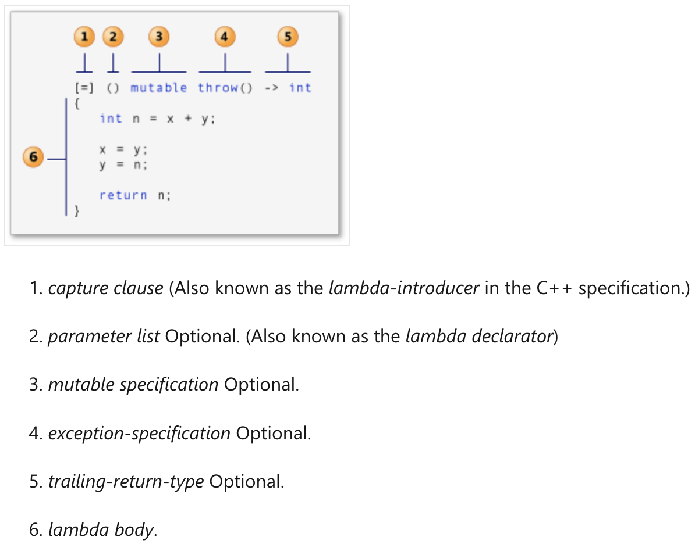

# In Memory Key Value Database Assignment

The goal of this assignment is to build a basic in-memory key-value database to introduce you to common database operations, such as _GET_, _SET_, _DELETE_, and transaction operations. Through this assigment, you will gain hands-on experience with foundational database concepts while applying important C++ programming techniques like dynamic memory allocation,and object-oriented design.

*Disclaimer: This assignment has been created by Justin Ventura (jmventur@andrew.cmu.edu) over 2024 winter break. Any doubts or ambiguity should be addressed ASAP in order to provide a helpful and beneficial experience for the students. Feedback is also very much welcome, so for assistance or suggestions, don't hesitate to reach out to me*

### Getting Started

#### Mac Users (Apple Silicon):

First, you will need Google's C++ testing framework. The following command will install the GTest lib and headers in `/opt/homebrew`.

```bash
brew install googletest
```

To build the project, you can use either the provided Makefile or the CMake build system (recommended). A Makefile is a simple build script used with the make tool, specifying how to compile and link the project. It is straightforward but less flexible for larger or cross-platform projects. Conversely, CMake is a more modern and versatile build system generator that can produce build scripts for multiple platforms and compilers, making it ideal for projects requiring portability and scalability.

**CMake (_recommended_)**

Configure your project in your favorite IDE, such as CLion (_recommended_), which can automatically detect and utilize the _CMakeLists.txt_ file for project setup. Once configured, you can build the project directly within the IDE. This also allows you to easily run the tests through the IDE's integrated testing tools or manually using the instructions provided below.

```bash
cd ./cmake-build-debug && ctest
```

**Makefile**

```bash
# make the driver for smaller test
make

# run the unit tests 
make test

# (optional) when you're done, clean up
make clean
```

### Windows User:

If you're on Windows, one option is to use Windows Subsystem for Linux (WSL), which provides a lightweight Linux environment directly within Windows. WSL allows you to run Linux tools, utilities, and IDEs seamlessly, making it a great choice for those who prefer a Linux-like development experience without leaving the Windows platform.

You can choose your preferred IDE, with WSL provided here as one of the options. Open the Windows Command Prompt.
```bash
# Install wsl
wsl --install
```

```bash
# Install the compiler for Linux
sudo apt update && sudo apt upgrade -y
sudo apt install cmake -y
sudo apt install build-essential -y
sudo apt install clang -y
```

```bash
# Install google test
git clone https://github.com/google/googletest.git

cd googletest
mkdir build && cd build

cmake ..
make

sudo make install
```
Place the file directory under the Linux root directory to run it using the above make command.

It is also encouraged to install CLion and CMake for futher team project.
Remember to set the compiler in CLion to WSL:
1. Navigate to Build, Execution, Deployment > Toolchains in the settings
2. Click the + on the left and choose WSL. The default compiler will be GCC.
   You can choose clang file to use Clang compiler, which is similar to the mac compiler
4. Save the toolchain configuration
5. When importing a project, select the previously saved WSL toolchain to use WSL for compilation


# CMU 18671 Quick C++ Bootcamp
This is not an exhaustive C++ guide, however it does touch on some of the topics that are relevant to understand C++ and complete the assignment. Additionally, you will need to answer a C++ quiz on the main topics discussed below.
Checkout [LEARN C++](https://learncpp.com) to learn even more!

## Table of Contents
- [1. Dynamic Memory Allocation, STL, Iterators](#1-dynamic-memory-allocation-stl-iterators)
  - [1.1 Dynamic Memory](#11-dynamic-memory)
  - [1.2 STL and Iterators](#12-stl-and-iterators)
- [2. Classes vs. Structs](#2-classes-vs-structs)
- [3. Inheritance and Polymorphism](#3-inheritance-and-polymorphism)
- [4. Template Metaprogramming](#4-template-metaprogramming)
- [5. Lambda Functions](#5-lambda-functions)


## 1. Dynamic Memory Allocation, STL, Iterators
This section covers three fundamental aspects of C++: Dynamic Memory Allocation, Standard Template Library (STL), and Iterators. Dynamic Memory Allocation allows flexible runtime memory management. The STL provides efficient, reusable data structures and algorithms. Iterators enable seamless traversal and manipulation of container elements, bridging data structures with algorithms.


### 1.1 Dynamic Memory
Dynamic Memory Allocation (DMA) allows us to allocate memory at runtime using the `new` operator and deallocate it using the `delete` operator. Why do we need this? When the size of a data structure is unknown at compile time, we use DMA to ensure that we actually have storage to hold the data. Through the power of Virtual Memory and RAM (refer to CMU's 18613 material for further reading), we can fit many more bytes into our process's heap memory than we could on the stack. Usually the stack's limit is around 8MB or something like that, whereas the heap (depends on RAM) can fit a multiple GBs.  Keep in mind though that if a machine has 8GB RAM, we can't necessarily store 8GB of data in our process's heap memory. Internal/external fragmentation is one problem, but also our systems run plenty of other processes that also need some memory for their own purposes as well. SWAP memory via Disk is helpful, but this does hurt performance. Just know, there are always limits and tradeoffs.

##### Example:
```cpp
// Wrapper for malloc; allocates 1000 * sizeof(int) + f fragmentation bytes
int arr = new int[1000];

// Deallocates those bytes.
delete arr;

// Allocates sizeof(double) bytes
double d = new double;
delete d;
```

In C, `malloc` (memory allocation) and `free` are system calls used to manage dynamic memory. The `new` and `delete` keywords in C++ are very similar to these sys calls, however they also call the constructor/destructor of a class. Keep in mind that `malloc(n)` simply attempts to allocate `n` bytes on the heap and returns a pointer to the starting address of a (virtually) contiguous block of `n` bytes. It doesn't know what a constructor is (classes are an addition to C++). We will talk about classes eventually, but for now use `new`/`delete` over `malloc`/`free` for this assignment.


In C++, `new` and `delete` are operators used for dynamic memory management, offering a higher-level alternative to `malloc` and `free`. They are type-aware and invoke constructors and destructors for objects, making them more suitable for C++ programming.


Quick example of a Slime class and how `new`/`delete` works with it:
```cpp
class Slime {
private:
  int hit_points_;
public:
  // Constructor
  Slime() : hit_points_(100) {
    std::cout << "Constructing Slime!\n";
  }
  ~Slime() {
    std::cout << "Destructing Slime!\n";
  }
};

Slime *slime = new Slime;
// will see Constructing Slime! in stdout

delete slime;
// will see Destructing Slime! in stdout
```

Failure to correctly deallocate data results in memory leaks, which can be really bad for long running processes. When the process is terminated, the OS will deallocate it for you, but during execution it could crash. An interesting thing to note is that the STL manages memory for its data structures for you. In the next section you'll see that we won't use the `new` keyword when initializing a vector or map.

For the more advanced readers, you may be wondering about smart pointers. For the sake of this assignment, since there may be some who are new to C++, I actually think it would be a disservice to go over how those work without having a solid foundation in manual memory management.

You can always read about them on your own, and feel free to make use of them if you already know how.

### 1.2 STL and Iterators
The Standard Template Library (STL) provides dynamic data structures like vectors (similar to Python List) and maps (similar to Python dictionary), along with iterators for traversal.

How to iterate over a vector:
```cpp
#include <vector>

int main() {
  // Using the int template; more on templates later
  int size = 100;
  std::vector<int> nums(size, 0);

  // Print out space separated 0 a hundred times
  for (const int i : nums) {
    std::cout << i << " ";
  }
  std::cout << "\n";
}
```

If you've done this in Python:
```py
# 1. existence check
if key in my_dict:
  print(f"Found key ${key} in my_dict with val: ${my_dict[key]}")

# 2. Iterate over the key value pairs
for key, val in my_dict:
  print(key, val)

# 3. add and remove from dict
my_dict[18671] = 'Foundations of Database Design'
del my_dict[18671]
```

You can do the same in C++:
```cpp
#include <string>
#include <unordered_map>

// A map from int to string
std::unordered_map<int, std::string> my_map;

// 1. existence check
auto iter = my_map.find(key);
if (iter != my_map.end()) {
  std::cout << "Found key " << iter->first << " in my_map with value: " << iter->second << "\n";
}

// 2. Iterate over key value pairs
for (const auto &[key, val] : my_map) {
  std::cout << key << " " << val << "\n";
}

// 3. Add and remove from map
my_map[18671] = "Foundations of Database Design";
auto iter = my_map.find(18761);
if (iter != my_map.end()) {
  my_map.erase(iter);
}
```

A few things to note: the `auto` keyword is pretty useful when dealing with iterators and types that are quite verbose. Don't over use this however, since it can make code unreadable in some situations. How `auto` works is relatively simple, it will deduce what the type should be based on the right hand side; in the case of `my_map.find(18671)`, we know (via the STL specs) that it will return an iterator of `unordered_map<int, std::string>`. If the key is in the map, the iterator gives us access to its `first` and `second` attributes which corresponds to the map key and value respectively. `auto` saves us the headache of writing:

```cpp
std::unordered_map<int, std::string>::iterator iter = my_map.find(18671);
```

There are more STL/Container(Set, Stack, Queue, etc) operations that you may find useful. Please refer to https://cplusplus.com/reference/stl/

## 2. Classes vs. Structs

In C++, structs and classes in C++ are almost exactly the same, however they do generally have different use cases.

| Aspect                     | struct                                       | class                                       |
|----------------------------|----------------------------------------------|---------------------------------------------|
| Default Access Modifier    | Public                                      | Private                                     |
| Inheritance Access Modifier | Public by default                           | Private by default                          |
| Intended Usage             | Used for Plain Old Data (POD) types or simple data structures. | Used for encapsulation and abstraction with private members. |
| Semantics                  | Typically conveys simplicity; used for grouping related data. | Conveys complexity; used for objects with behavior and state. |


The key difference lies in their default access specifiers:
- **Structs**: Members are `public` by default.
- **Classes**: Members are `private` by default.

**When to use one over the other:**
- Use `struct` for plain data objects without complex behavior.
- Use `class` when encapsulation or complex behavior is required.

As you probably already know, instances of each class and struct is basically just a contiguous group of bytes (for each member variable).

```cpp
class Entity {
  std::string name_; // 24 or 32 bytes
  int hit_points_; // 4 bytes
};

// Depends on backend compiler; usually 32 or 40 bytes (aligned to 8)
std::cout << sizeof(Entity) << "\n";
```

Assuming the memory is aligned to 8 bytes, 4 padding bytes are added to the hit_points_ integer. So far, this isn't much different from regular C structs. However, things get a little interesting when our class is more fleshed out.

```cpp
class Entity {
protected:
  std::string name_; // 24 or 32 bytes
  int hit_points_; // 4 bytes
public:
  // Default constructor
  Entity() : name_("Unnamed Entity"), hit_points_(0) {
    std::cout << "Unnamed Entity constructed with 0 hit_points.\n";
  }

  // Parameterized constructor
  Entity(const std::string &name, int hit_points) : name_(name), hit_points_(hit_points) {
    std::cout << "Entity << " << name_ << "constructed with " << hit_points_ << "hit_points.\n";
  }
};
```

The size is still 32 or 40 bytes, however now we have some new constructors in the code (text) section in the programs memory. When do `Entity e;` in our code, the compiler generates assembly code something like this:

1. Allocate 32/40 bytes on the stack.
2. Decides which constructor it matches (default in this case).
3. Depending on which constructor it matches, it will generate the code from that constructor, and pass it a pointer to the instance class, called `this`. This is so that it knows which instance member variables (if any) need to be initialized.
4. In this case: generates code to call the `std::string` constructor with the parameter "Unnamed Entity", which ends up storing that string in the `name_` member variable corresponding to the `this` pointer.
5. Then generates code to store the integer 0 into `hit_points_`.

You might be wondering about the `std::string`. Depends the compiler for the size but here is a very loose and example of what it might look like (you can check for yourself by inspecing the string library)

```cpp
class string {
    char* buffer;      // Pointer to heap-allocated memory (8 bytes)
    size_t size;       // Number of characters in the string (8)
    size_t capacity;   // Capacity of the allocated buffer (8)
    // ... other stuff
};
```

So during the string's construction, it will it call its constructor, and do whatever it needs to do. Don't worry too much about this, for the sake of our examples it just takes up 32 or 40 bytes usually. The main thing to note is that it contains a pointer to a char array underneath, which is dynamically allocated in our case, so even if it uses 32 bytes on the stack, it likely contains a pointer to however bytes is needed to store our string on the heap.

You may want to look further into:

- Copy constructors
- Destructors
- Overloaded assignment operator (and other overloads)
- The "rule of 5"

## 3. Inheritance and Polymorphism

Inheritance allows a class to derive properties from another class. Polymorphism enables overriding functions for dynamic behavior using a virtual table (vtable). Let's go through a more practical example by expanding on the previous Entity example. Let's make a subclass of Entity; the Slime. The Slime is also an Entity (it inherits everything from the parent), but has might have some of its own unique characteristics.

```cpp
class Slime : public Entity {
public:
  Slime() : name_("Slime") {
    std::cout << "Slime constructed.\n";
  }

  Slime(const std::string &name, int hit_points) : name_("Slime"), hit_points_(100) {
    std::cout << "Slime constructed.\n";
  }

  ~Slime() {
    std::cout << "Slime destructed.\n";
  }

  void PrintName() {
    std::cout << name_ << " the Slime.\n";
  }
};
```

Something you may have noticed is that in the constructor, following the colon (:) we have something called the member intializer list. In this case, we are initializing the `name_` and `hit_points_` attribute that we inherited from the Parent class Entity.

A classic pattern with classes in C++ is to have most attributes be private (refer to the Entity class), but then provide an interface to access some of them. This of course depends on the purpose of the attributes. A general rule of thumb is to make all member variables private unless you absolutely need them to be public (for this assignment, most likely all variables should be private).

Another thing you may have noticed is that each member variable ends with an under score (_). According to the Google C++ style guide, which this assignment will follow, the underscore suffix indicates a member variable. This way there is less confusion between the member variables and method parameters.

So now let's take a look at what the entity (abstract base class in this case) might look like:

```cpp
// An abstract base class representing a game entity
class Entity {
private:
    std::string name_;
    int hit_points_;

public:
    // Default constructor
    Entity() 
        : name_("Unknown"), hit_points_(0) {
        std::cout << "Entity constructed (default).\n";
    }

    // Constructor with parameters
    Entity(const std::string &name, int hit_points)
        : name_(name), hit_points_(hit_points) {
        std::cout << "Entity constructed (" << name << ", " 
                  << hit_points << ").\n";
    }

    // Virtual destructor (important for abstract base classes)
    virtual ~Entity() {
        std::cout << "Entity destructed.\n";
    }

    const std::string &GetName() const {
        return name_;
    }

    void SetName(const std::string &new_name) {
        name_ = new_name;
    }

    int GetHitPoints() const {
        return hit_points_;
    }

    void SetHitPoints(int new_hit_points) {
        hit_points_ = new_hit_points;
    }

    // Pure virtual function to make this class abstract
    // Derived classes must provide an implementation
    virtual void PrintName() const = 0;
};
```

Note that we need at least one function (like `PrintName` in this case) as pure virtual (= 0) to make Entity an abstract base class. This means you cannot create instances of Entity directly; instead, you must inherit from Entity and implement the pure virtual functions (inheriting the other methods). This is typically done when you want to provide a generic interface (e.g., what every game entity should do), but leave the specific implementations up to the derived classes (e.g., Slime, Goblin, Player, etc.).

When you intend to inherit from a class and potentially manage derived objects through pointers to the base class, it’s important to have a virtual destructor. This ensures that when you delete an object of a derived class through a base pointer, the correct destructor (the derived one) is called. Otherwise, you can end up with resource leaks or incomplete destruction.

Something I would encourage you to do is make your own base and derived classes, and put some prints in your constructors and destructors to see how they are invoked!

## 4. Template Metaprogramming

Using templates in C++ is actually not as difficult as it may look! The purpose of templates is to allow functions or classes to be written once, but work for many data types, including user defined classes. If you've learned about function overloading, you might be thinking: "what is the point of this then?" Well the main difference between the two is that with templates, you have to assume the exact operations used within the context of the function or class are supported by every data type. With function overloading, you should use this for when different types warrant different operations or behavior. The reason why is that when you make a template function, you (for the sake of this assignment) can't differentiate different types, the compiler will generate the same code for all types but replace the template variables with the type requested:

```cpp
template <typename T>
T add(T first, T second) {
    return first + second;
}

int main() {
    int x = 1, y = 2;
    int z = add(x, y); // Compiler creates an instance of add<int>()

    float a = 3.1415f, b = 6.9f;
    float c = add(a, b); // Compiler creates an instance of add<float>()

    return 0;
}

```

The compiler is smart, what it will do is only generate templates for functions/classes that have been requested. There are three ways to let the compiler know to generate them is:

1. Implicit instantiation: the code above is an example of this. The compiler will implicitly generate the templates.
2. Explicit instantiation: if you know ahead of time what types you'll be needing, you can do something like the code block below this list.
3. Explicit specialization: this allows for somewhat similar behavior as function overloading, but this is beyond the scope of this guide.

```cpp
// template function:
template <typename T>
T multiply(T first, T second) {
    return first * second;
}

// Explicit instantiation example:
template int multiply<int>(int, int);
template float multiply<float>(float, float);
```

You can also use templates for variadic arguments:

```cpp
template <typename... Args>
void countArgs(Args... args) {
    std::cout << "Number of arguments: " << sizeof...(args) << std::endl;
}

template <typename First, typename... Rest>
void f(First first_arg, Rest... others) {
  // who knows...
  first_arg(others...);
}
```

Variadic arguments like above might be useful when combined with lamdbas for this assignment, but it is not required and could be overkill for the sake of this assignment.

You can also use this for a class:

```cpp
template <typename T> class MyClass {
private:
  T my_var_;
public:
  MyClass(T var) : my_var_(var) { }
  void Print() {
    std::cout << my_var_ << "\n";
  }
};

// ...

MyClass<int> *my_obj = new MyClass<int>();
my_obj->Print();
delete my_obj;
```

To briefly understand how these templates actually work you can think of it like this: during compile time, if there is an instantiation of a template, then the compiler will generate the code for each type that is instantiated. For example:

```cpp
template <typename T>
T add(T x, T y) {
  return x + y;
}

// if it sees add(1, 2), it generates...

int add(int x, int y) {
  return x + y;
}
```

Do note, if a custom data type does not support the `+` operator, you will have some problems when trying to use the above `add` template for that type.

## 5. Lambda Functions

Lambdas can be pretty confusing, so lets disect it piece by piece. This explanation by [Microsoft](https://learn.microsoft.com/en-us/cpp/cpp/lambda-expressions-in-cpp?view=msvc-170) is pretty solid:



Lambdas in a nutshell are "anonymous functions," which means that they are functions which can be used as objects. The key things you need to know is the scope of the lambda, how the parameters are acquired (for performance reasons mostly), and how we can make use of them.

1. The capture clause: I recommend playing around with this, but this specifies *how* to "capture" the parameters for the function. `[=]` means to simply make a copy of all parameters. The lambda won't have any of your variables in scope, so you can choose how the lambda gets access, if any. Below we'll talk about parameters, but maybe we want to pass one by value, and one by reference, we'd do: `[x, &y]`; x is copied over, and y is passed by reference (address). There is a lot more you can do with this, so please play around with it for yourself to understand more deeply how it works.
2. Parameter list: this is very similar to how you have parameters for a regular function. These are not to be confused with the captured variables, since these are simply the actual function parameters. The capture variables can be used inside the function if you need more context within the lambda, but are not required if you just need a simple lambda.
3. If you specify the keyword `mutable`, then the captured by value variables can be modified. You most likely won't need this for the assignment.
4. Exception specification: You can specify `throw()` or `noexcept`, but again, you won't need this. It can be useful in exception safe programming.
5. Trailing return: I recommend using this when possible in general, since it helps with readability, but it is optional. In the assignment, you may not need it.
6. Lambda body: The business logic of your actual lambda; here you can make use of captured variables and specified arguments.

A case I tend to use lambdas for the most is passing them as custom comparators in sorting:

```cpp
std::sort(words.begin(), words.end(), [](const std::string& a, const std::string& b) {
    return a.size() < b.size();
});
```

This lambda sorts words by the number of characters in each string, with smaller strings appearing earlier. Another convenient thing about lambdas is that we can store in data structures such an `std::vector<std::function<void()>>` (could be void, or another type, depending on the function return value):

```cpp
std::vector<std::function<void()>> f(int x, int y) {
    std::vector<std::function<void()>> vec;
    // Lambda to add x and y
    vec.emplace_back([x, y]() {
        std::cout << "Addition: " << (x + y) << std::endl;
    });

    // Lambda to multiply x and y
    vec.emplace_back([x, y]() {
        std::cout << "Multiplication: " << (x * y) << std::endl;
    });

    // Lambda to print the values of x and y
    vec.emplace_back([x, y]() {
        std::cout << "Values: x = " << x << ", y = " << y << std::endl;
    });

    return vec;
}
```

A bit of a hint for the assignment is that you can (but are required to) use lambdas perhaps for storing undo operations.
